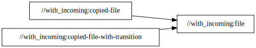
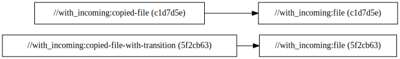

# `with_incoming`

This package is nearly identical to `without_transitions`, except that it defines a
configuration setting and an incoming transition on `copy_file` targets that changes the value of
that setting depending on the value of the `dummy_setting` attribute. In a real ruleset, this
configuration setting might be used to resolve a toolchain or configure the compiler in some way,
but it doesn't actually do anything here.

```diff
diff --exclude README.md without_transitions/BUILD.bazel with_incoming/BUILD.bazel
1a2,7
> load("@bazel_skylib//rules:common_settings.bzl", "string_setting")
>
> string_setting(
>     name = "dummy-setting",
>     build_setting_default = "foo",
> )
9c15
<     name = "copied-file-1",
---
>     name = "copied-file",
14c20,21
<     name = "copied-file-2",
---
>     name = "copied-file-with-transition",
>     dummy_setting = "bar",
diff --exclude README.md without_transitions/rules.bzl with_incoming/rules.bzl
0a1,2
> load(":transition.bzl", "dummy_incoming_transition")
>
46a49
>     cfg = dummy_incoming_transition,
Only in with_incoming: transition.bzl
```

You'll see that the dependency graph has changed a bit:

```
$ bazel query 'kind("_file rule$", //with_incoming:*)' \
    --nograph:factored \
    --output graph | dot -Grankdir=LR -Tsvg
```



`:file` is the same as it was before, but we've also defined `:copied-file` and
`:copied-file-with-transition`. The former depends on `:file` as normal, but the latter sets
`dummy_setting` to `bar` so that both it and `:file` are built under a different configuration.

That's why `:file` now produces two nodes in the build graph, both of which are annotated with
different configuration hashes:

```
$ bazel cquery 'kind("_file rule$", //with_incoming:*)' \
    --nograph:factored \
    --output graph | dot -Grankdir=LR -Tsvg
```



If we delve even further into the
[action graph](https://bazel.build/reference/glossary#action-graph), we see that the actions
generated under both configurations have different commands and therefore different hashes. This
will cause them both to be executed, even though neither depends on the configuration and the
output will be the same:

```
$ bazel aquery 'mnemonic("^StaticFile$", //with_incoming:file)' 2> /dev/null
action 'StaticFile with_incoming/file/output.txt'
  Mnemonic: StaticFile
  Target: //with_incoming:file
  Configuration: k8-fastbuild-ST-4d0a34e95ebd
  Execution platform: @platforms//host:host
  ActionKey: 561b8bf15acfe96ec923f0b116c9305787f3c1567c7be1d692859c755b4c41de
  Inputs: []
  Outputs: [bazel-out/k8-fastbuild-ST-4d0a34e95ebd/bin/with_incoming/file/output.txt]
  Command Line: (exec /bin/bash \
    -c \
    'echo '\''Generating static file...'\''; echo "$1" > "$2"' \
    '' \
    'Hello, world!' \
    bazel-out/k8-fastbuild-ST-4d0a34e95ebd/bin/with_incoming/file/output.txt)
# Configuration: 5f2cb63e0145e42079504e260e94f14114230d15febdbfded2516fd47e1e263a
# Execution platform: @@platforms//host:host

action 'StaticFile with_incoming/file/output.txt'
  Mnemonic: StaticFile
  Target: //with_incoming:file
  Configuration: k8-fastbuild
  Execution platform: @platforms//host:host
  ActionKey: a0138cfc69ae6eef5680cbf831109be2c24e3b38d159971a1c8938bfaa0412a4
  Inputs: []
  Outputs: [bazel-out/k8-fastbuild/bin/with_incoming/file/output.txt]
  Command Line: (exec /bin/bash \
    -c \
    'echo '\''Generating static file...'\''; echo "$1" > "$2"' \
    '' \
    'Hello, world!' \
    bazel-out/k8-fastbuild/bin/with_incoming/file/output.txt)
# Configuration: c1d7d5ec98965ef297d5c260736c24f7fcb9fd5039103a0c4ab253e2b94ae32b
# Execution platform: @@platforms//host:host
```

Finally, we can verify this by building `:copied-file` and `:copied-file-with-transition`. Notice
the duplicated "Generating static file..." messages:

```
$ bazel clean
$ bazel build //with_incoming:copied-file //with_incoming:copied-file-with-transition
INFO: Invocation ID: c3ea4495-f0ca-47b4-a416-f30f3ca37cc9
INFO: Analyzed 2 targets (6 packages loaded, 13 targets configured).
INFO: From StaticFile with_incoming/file/output.txt:
Generating static file...
INFO: From StaticFile with_incoming/file/output.txt:
Generating static file...
INFO: Found 2 targets...
INFO: Elapsed time: 0.228s, Critical Path: 0.01s
INFO: 5 processes: 4 disk cache hit, 1 internal.
INFO: Build completed successfully, 5 total actions
```

[with_incoming_and_outgoing/README.md](../with_incoming_and_outgoing/README.md) explores one
possible solution to this problem.
