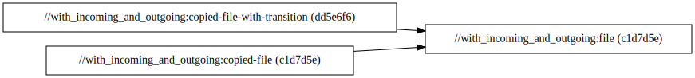

# `with_incoming_and_outgoing`

This package attempts to solve the issue described in `with_incoming_and_outgoing` of `:file` being
built twice. It does so via an outgoing transition on the `input` attribute of `copy_file` that
resets the configuration to its default state.

```diff
diff --exclude README.md with_incoming/BUILD.bazel with_incoming_and_outgoing/BUILD.bazel
1a2
> load(":setting.bzl", "dummy_setting_default")
6c7,21
<     build_setting_default = "foo",
---
>     build_setting_default = dummy_setting_default,
> )
>
> config_setting(
>     name = "dummy-setting-foo",
>     flag_values = {
>         ":dummy-setting": "foo",
>     },
> )
>
> config_setting(
>     name = "dummy-setting-bar",
>     flag_values = {
>         ":dummy-setting": "bar",
>     },
22a38,52
> )
>
> static_file(
>     name = "dynamic-file",
>     content = select({
>         ":dummy-setting-foo": "The setting is foo.",
>         ":dummy-setting-bar": "The setting is bar.",
>         "//conditions:default": "The setting is neither foo, nor bar.",
>     }),
> )
>
> copy_file(
>     name = "copied-dynamic-file",
>     dummy_setting = "bar",
>     input = ":dynamic-file",
diff --exclude README.md with_incoming/rules.bzl with_incoming_and_outgoing/rules.bzl
1c1
< load(":transition.bzl", "dummy_incoming_transition")
---
> load(":transition.bzl", "dummy_incoming_transition", "dummy_outgoing_transition")
45a46
>             cfg = dummy_outgoing_transition,
Only in with_incoming_and_outgoing: setting.bzl
diff --exclude README.md with_incoming/transition.bzl with_incoming_and_outgoing/transition.bzl
0a1,2
> load(":setting.bzl", "dummy_setting_default")
>
3c5
<         "//with_incoming:dummy-setting": attr.dummy_setting,
---
>         "//with_incoming_and_outgoing:dummy-setting": attr.dummy_setting,
9c11,22
<     outputs = ["//with_incoming:dummy-setting"],
---
>     outputs = ["//with_incoming_and_outgoing:dummy-setting"],
> )
>
> def _dummy_outgoing_transition_impl(settings, attr):
>     return {
>         "//with_incoming_and_outgoing:dummy-setting": dummy_setting_default,
>     }
>
> dummy_outgoing_transition = transition(
>     implementation = _dummy_outgoing_transition_impl,
>     inputs = [],
>     outputs = ["//with_incoming_and_outgoing:dummy-setting"],
```

Let's check the build graph to verify that `:file` isn't duplicated:

```
$ bazel cquery 'kind("_file rule$", deps(//with_incoming_and_outgoing:copied-file + //with_incoming_and_outgoing:copied-file-with-transition))' \
    --nograph:factored \
    --output graph | dot -Grankdir=LR -Tsvg
```



Problem solved! ...Almost. Let's define a `static_file` target named `dynamic-file` that depends on
the configuration on the target depending on it. Then, we'll define a `copy_file` target
`copied-dynamic-file` that transitions the configuration value to `bar` and depends on
`dynamic-file`.

```starlark
static_file(
    name = "dynamic-file",
    content = select({
        ":dummy-setting-foo": "The setting is foo.",
        ":dummy-setting-bar": "The setting is bar.",
        "//conditions:default": "The setting is neither foo, nor bar.",
    }),
)

copy_file(
    name = "copied-dynamic-file",
    dummy_setting = "bar",
    input = ":dynamic-file",
)
```

Unfortunately, `dynamic-file` isn't able to use the configuration at `copied-dynamic-file` because
it's reset before it can "reach" `dynamic-file`. Notice how the output of `copied-dynamic-file` is
`The setting is foo.`, not `The setting is bar.`:

```
$ bazel build //with_incoming_and_outgoing:copied-dynamic-file
$ cat bazel-bin/with_incoming_and_outgoing/copied-dynamic-file/output.txt.copy
The setting is foo.
```

Ideally, we'd like `static_file` targets to be re-built only when the configuration makes a
difference, and their output to be cached when it doesn't.

See [with_incoming_and_path_mapping/README.md](../with_incoming_and_path_mapping/README.md) for a
best-of-both-worlds approach to this problem.
