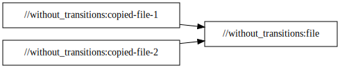
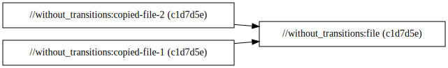

# `without_transitions`

This package demonstrates the simplest arrangement: two `copy_file` targets that depend on a single
`static_file` target, without any user-defined configuration or transitions. All of the other
packages in this repository are variations on this one.

If we query the dependency graph, which is generated during the
[loading phase](https://bazel.build/reference/glossary#loading-phase), we can see that every target
has a single node:

```
$ bazel query 'kind("_file rule$", //without_transitions:*)' \
    --nograph:factored \
    --output graph | dot -Grankdir=LR -Tsvg
```



That doesn't tell us how many times each target is built because it's possible that a target could
be dependened on under different [configurations](https://bazel.build/extending/config). In that
case, that target might be built differently depending on the configuration, requiring its actions
to be executed multiple times.

For that, we need to query the build graph, which is generated during the
[analysis phase](https://bazel.build/reference/glossary#analysis-phase):

```
$ bazel cquery 'kind("_file rule$", //without_transitions:*)' \
    --nograph:factored \
    --output graph | dot -Grankdir=LR -Tsvg
```



Here we can see that indeed, every target is built under a single configuration: `c1d7d5e`.

See [with_incoming/README.md](../with_incoming/README.md) to understand where this is not the case.
